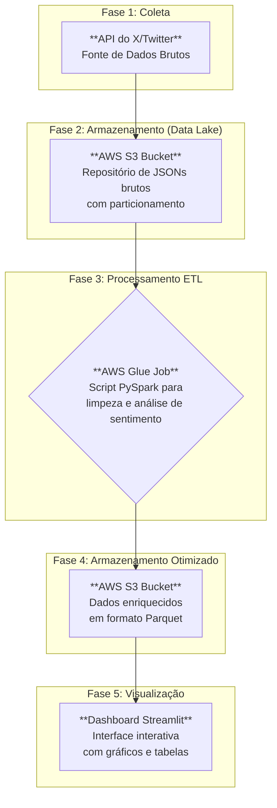

# 🌡️ Projeto: Termômetro de Sentimento da Web

### **Uma solução de Engenharia de Dados ponta-a-ponta na nuvem AWS, que transforma o fluxo caótico de dados do Twitter em inteligência de mercado acionável e em tempo real.**

---

  
  
  
  

---

## 🎯 O Desafio de Negócio

No cenário digital atual, a opinião pública nas redes sociais é um ativo de valor inestimável, mas volátil e massivo. Empresas que conseguem capturar e analisar esse sentimento em tempo real ganham uma vantagem competitiva absurda. O desafio é: como construir um sistema escalável, automatizado e custo-efetivo para transformar milhões de tweets em insights claros e objetivos?

## 🏛️ Arquitetura da Solução

Este projeto implementa um pipeline de dados moderno e serverless na AWS, desenhado para máxima eficiência e escalabilidade. Cada etapa do fluxo foi construída com as melhores práticas de engenharia de dados, conforme ilustrado abaixo.

---

## ✨ Features de Destaque

* **Arquitetura Serverless e Custo-Efetiva:** Utiliza serviços gerenciados da AWS (S3, Glue, IAM) para criar um pipeline que escala sob demanda e minimiza custos operacionais e de infraestrutura.
* **Processamento Distribuído com PySpark:** O coração do ETL usa o poder do Apache Spark para processar grandes volumes de dados de forma paralela e eficiente, aplicando a análise de sentimento com a biblioteca `TextBlob`.
* **Armazenamento Otimizado para Analytics:** Os dados brutos são salvos em JSON, e os dados processados e enriquecidos são armazenados no formato colunar **Parquet**, drasticamente otimizado para consultas analíticas rápidas.
* **Dashboard Interativo e Data-Driven:** A interface, construída com Streamlit, lê os dados processados diretamente do S3 e apresenta os insights de forma clara, permitindo que a área de negócio consuma a informação sem precisar de conhecimento técnico.

---

## 🛠️ Stack de Tecnologias

| Categoria | Tecnologia | Propósito |
| :--- | :--- | :--- |
| **Linguagem** | `Python` | Linguagem principal para scripts de coleta e processamento. |
| **Coleta** | `Tweepy` | Biblioteca para interação com a API do X/Twitter. |
| **Cloud (AWS)** | `S3`, `Glue`, `IAM` | Data Lake, serviço de ETL serverless e gerenciamento de permissões. |
| **Big Data** | `PySpark` | Processamento de dados em larga escala no AWS Glue. |
| **Análise de Sentimento** | `TextBlob` | Biblioteca para análise de Processamento de Linguagem Natural (PLN). |
| **Visualização** | `Streamlit`, `Plotly` | Construção do dashboard interativo e dos gráficos. |
| **Ferramentas** | `Git`, `Docker` | Controle de versão e conteinerização. |

---

## 👨‍💻 Autor

Desenvolvido por **Carlos Henrique Dias Dos Santos**.

* **LinkedIn:** [linkedin.com/in/carlos-henrique-2a0008378](https://linkedin.com/in/carlos-henrique-2a0008378)
* **GitHub:** [@henrique999930-1gtm](https://github.com/henrique999930-1gtm)
